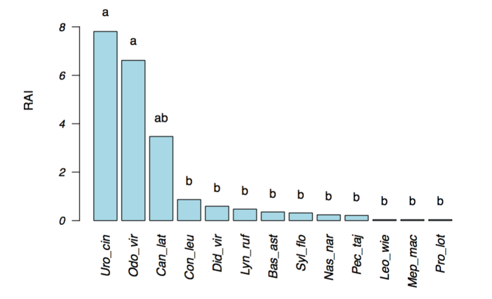
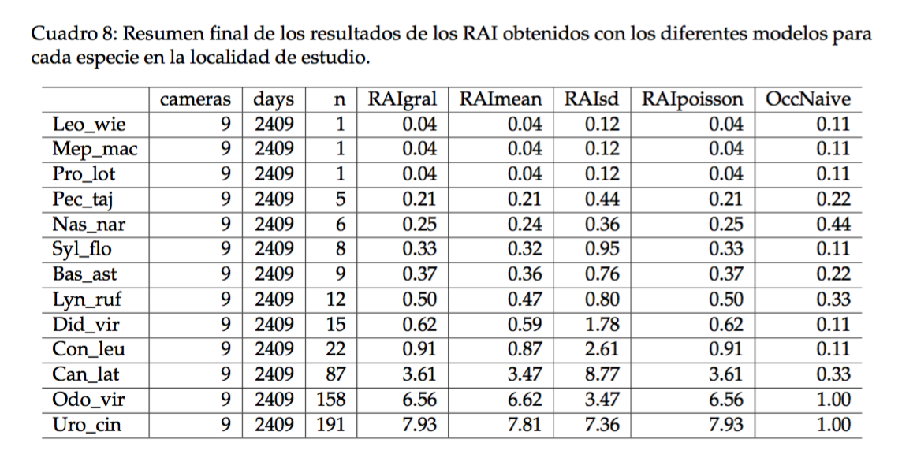

# Introducción

---

- Los índices de abundancia relativa (IAR o también conocidos como RAI por sus siglas en inglés) tienen larga tradición en los estudios y monitoreo de fauna silvestre (Crawford 1991; Caughley and Sinclair 1994); particularmente, para especies raras y/o difíciles de detectar (Thompson 2013). 

- Frecuentemente los RAI son usados como un indicador de la abundancia de la(s) especie(s) en el sitio de estudio (Sutherland 2006; O’Brien 2011).

- En algunos casos, los índices son calibrados o convertidos a densidad poblacional  (O’Brien 2011).


# Algunos RAI clásicos son los basados en:

---

- estaciones olfativas (Linhart y Knowlton 1975; Conner et al. 1983), 
- conteo de aves en puntos por unidad de tiempo (Johnson 2008), 
- conteo de nidos y madrigueras (Mathewson et al. 2008; Hanser et al. 2011), 
- conteo de huellas a lo largo de caminos (Stephens et al. 2006; Winterbach et al. 2016), 
- conteo de excrementos en parcelas (Eberhardt and Van Etten 1956; Campbell, Swanson, and Sales 2004), 
- conteos de senderos (McCaffery 1976) y otros. 

# Cámaras-trampa

---

- En particular, con el fototrampeo es muy frecuente calcular el RAI (Bengsen et al. 2011; O’Brien 2011). 

- Por ejemplo, con ungulados (Rovero and Marshall 2009; Gómez-Valencia and Montenegro 2016), felinos (Bengsen, Butler, and Masters 2012), lepóridos (Marchandeau et al. 2006), entre muchos. 

# Supuestos principales del RAI: 

---

1. Una relación lineal positiva entre la abundancia (N) de la población y el RAI.
2. Paraa una misma especie que el RAI se comporta similar en diferentes localidades y en diferentes estaciones del año.
3. Una constante o similar probabilidad de detección (temporal y espacialmente) para una misma especie y entre especies.
4. Que el RAI no es afectado por la ubicación espacial de las cámaras.

# Limitantes del RAI:

---

1. No calcula intervalos de confianza de manera que no se puede evaluar el poder estadístico para detectar cambios en las poblaciones.
2. Generalmente se calcula usando pocas cámaras lo cual puede sesgar la estimación, sobre todo si las cámaras no se colocan de manera aleatoria.
3. Frecuentemente el diseño de muestreo está hecho para una especie en particular, por ejemplo algún depredador, y luego se utilizan todos los datos de las especies obtenidas en las cámaras.
4. Es común poner las cámaras en los senderos y caminos; o bien en sitios seleccionados donde se sabe pasará el animal de interes. También es muy frecuente y discutible el empleo de atrayantes.

# Por lo tanto:

---

- El cálculo e interpretación del RAI es relativamente simple: basado únicamente en el valor del índice se determina cuáles son las especies “más o menos abundantes”. 

- Esta interpretación es cualitativa y subjetiva pero se reporta en la mayoría de los trabajos como una medida indirecta de la abundancia de cada especie. 

- En muchos casos esta comparación carece de rigor estadístico por lo que las conclusiones deben tomarse con mucho cuidado.

## Objetivos de la conferencia

---

- Se presenta y ejemplifica la aplicación del paquete `RAI` que hemos desarrollado en mi laboratorio. 

- En particular, en esta ocasión se presenta paso a paso el procedimiento para estimar el RAI considerando dos modelos:

1. RAI tradicional o clásico;
2. RAI alternativo que permite estimar la variación considerando los datos de cada cámara como replicas, y luego compararlos estadísticamente.

# Modelo clásico o general

---

$$RAI_{i} = \frac{n_{tot}}{dias_{tot}} \times 100$$ 

donde: $n_{tot}$ es el número total de registros fotográficos independientes de la *i*-especie (60 min y 1440 min), $dias_{tot}$ es el esfuerzo de muestreo o número total de días, y 100 es el factor de corrección estándar. 

---

# Modelo alternativo

---

- Una manera muy sencilla de comparar estadísticamente el RAI entre especies en una misma localidad, o de la misma especie en diferentes estaciones y/o localidades diferentes, es calculando el RAI por cámara. 

$$RAI_{ij} = \frac{n_j}{dias_j} \times 100$$ 


donde: el subíndicie *i* se refiere a cada especie y el subíndice *j* a cada cámara-trampa. 

- Por lo tanto, con esta ecuación se calcula no solo el promedio sino además permite estimar alguna medida de la variación, lo cual es relevante para comprobar estadísticamente posibels diferencias significativas. 

---

# Descripción del paquete `RAI`

```{r, echo=FALSE, message=FALSE, warning=FALSE, fig.align = 'center'}
knitr::include_graphics("figs/f1.jpg", dpi = 500 )
```

---
  
# Ejemplo de aplicación del paquete
  
## Cargar el paquete y datos

```{r}
source("R/pkgRAI_1.R")
```

```{r}
wildlife.data <- read.csv("datos/mamiferos.csv", header = T)
attach(wildlife.data)
```

```{r, message=FALSE, warning=FALSE}
habitat.data <- read.csv("datos/habitat.csv", header = T) 
attach(habitat.data)
```

---

```{r tab1,  echo=FALSE, message=FALSE, warning=FALSE, results='asis'}
knitr::kable(head(wildlife.data, 10), caption = "Datos básicos por especie del número de registros independientes y esfuerzo de muestreo en cada cámara. Aquí se presentan solo los primeros 10 renglones de un total de 117.")
```

---

```{r, echo=FALSE, message=FALSE, warning=FALSE}
knitr::kable((habitat.data), caption = "Datos de UTMs y covariables asociados a cada cámara-trampa.")
```


```{r, message=FALSE, warning=FALSE, include=FALSE}
new.mat <- merge(x = wildlife.data, y = habitat.data, by = "Camera", all = TRUE)
library(kableExtra)
library(xtable)
knitr::kable(head(new.mat, 10), caption = "Datos por especie en cada cámara.", format = "latex", booktabs = TRUE)
```

---

# RAI modelo general o clásico

Empleando la función `RAIgral()` se crea:

```{r, echo=FALSE, message=FALSE, warning=FALSE}
Tot_cameras <- with(new.mat, length(unique(Camera))) 
cameras <- with(new.mat, tapply(Camera, Species, length)) 
days <- with(new.mat, tapply(Effort, Species, sum))   
n <- with(new.mat, tapply(Events, Species, sum))   

occ <- subset(new.mat, new.mat$Events > 0)
OccNaive <- as.data.frame(round(table(occ$Species)/cameras,2))

RAIgral <- round(n/days*100, 2) 
table.1 <- cbind(cameras, days, n, RAIgral, OccNaive = OccNaive[,2])
table.1 <- table.1[order(RAIgral),]

knitr::kable(table.1)
```

---

# Ocupación naive y distribución de especies/cámara
  
La proporción de sitios ocupados frecuentemente llamada "ocupación naive", es una medida simple de la distribución de cada especie en el sitio de estudio. Por ejemplo aquí se seleccionan cuatro especies:

```{r}
especie <- c("Uro_cin", "Can_lat", "Odo_vir", "Syl_flo") 
```

---


---

# Modelo alternativo
  
Para calcular el RAI de acuerdo a la **Eq.2** se ejecuta la función `RAIalt()` y se obtiene automáticamente:


```{r, echo=FALSE, message=FALSE, warning=FALSE}
 RAIalt <- with(new.mat, round((Events/Effort)*100, 2))
  table.2 <- cbind(new.mat, RAIalt)
```


---

## Gráficamente 


---

## Comparación estadística entre especies

Para conocer si hay diferencias se puede contrastar estadísticamente los RAI de las especies mediante un análisis de varianza de una vía especificado en R como `lm(RAI ~ Especie)` con la función `RAIaov()` 

```{r, echo=FALSE, message=FALSE, warning=FALSE, results= "asis"}
RAIaov <- aov(RAIalt ~ Species-1, data = new.mat)
mod <- summary(RAIaov)
t <- xtable(mod)
print.xtable(t, type = "latex", caption.placement = "top")
```

---

## Comparación posterior:



---

# Tabla final



---

# Conclusiones

- `RAI` es un paquete R muy sencillo de emplear.

- Tiene funciones que ejecuta de manera casi automática diferentes cálculos del RAI.

- Crea Tablas y Figuras de manera automática.

- Analiza estadísticamente el RAI.
