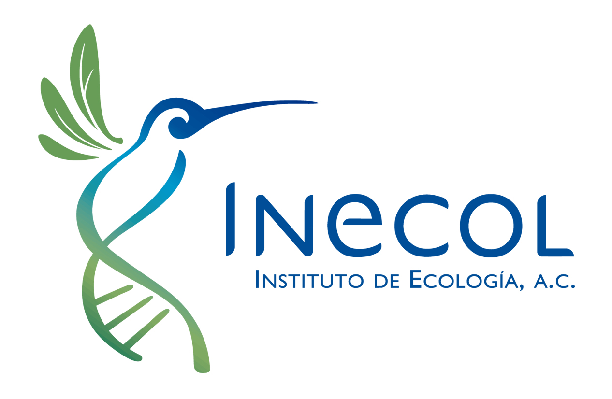

# Taller: Integrando tu tesis desde R

**Salvador Mandujano Rodríguez**

Como parte del curso de posgrado "**Introducción a la Investigación**".

Semana del 28 de Septiembre al 2 de Octubre del 2020.

Horario 10:00 a 14:00 h.

En este taller aprenderemos a integrar un documento de tesis con R, RStudio, RMarkdown, RPubs, GitHub y otros.

El material que emplearemos son códigos R, datos de prueba y otros recursos que resultan más sencillos depositarlos y luego bajarlos como .zip o bien clonar desde GitHub Desktop.

Además del material que se empleará durante las clases, se han incluido algunos PDFs de las presentaciones.

Saludos!

