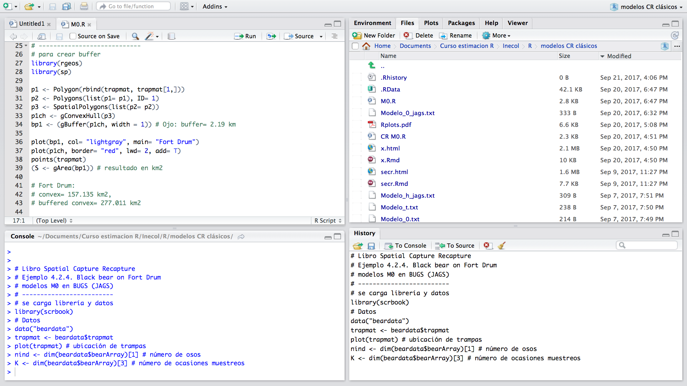

**Integrando tu tesis con `R`, `RStudio`, `RMarkdown`, `RPubs` y `GitHub`"**

*Salvador Mandujano Rodríguez*
  
# Introducción
  
- Indudablemente estamos en la época `R`...! 
  
- Esto se debe, entre otros factores, a que este "programa" o ambiente de programación, proporciona un amplio abanico de herramientas estadísticas, gráficas, crear funciones propias, entre algunos. 

- Pero sobre todo, `R` es gratuito y los interesados pueden descargar directamente de la biblioteca CRAN (http://cran.r- project.org/) más de 14 mil paquetes para innumerables propósitos. 

```{r R1, echo=FALSE, fig.align='center', message=FALSE, warning=FALSE, out.width="85%"}
knitr::include_graphics("fig2/col2.jpg")
```

---
  
# Universo `R`
  
- Existen muchos recursos para aprender a usar y aplicar `R` en las más variadas diciplinas.

```{r R1000, echo=FALSE, fig.align='center', message=FALSE, warning=FALSE, out.width="85%"}

```

---
  
# Ecología con `R`
  
```{r R1001, echo=FALSE, fig.align='center', message=FALSE, warning=FALSE, out.width="85%", fig.cap=""}
knitr::include_graphics("fig2/C4.jpg")
```

---
  
# Objetivo del taller
  
  
1) Describir las principales características y ventajas del programa `R`. 

2) Introducir `RStudio` como una plataforma muy sencilla, amable y útil para procesar los análisis en `R`. 

3) Integrar tu documento de tesis con el paquete `RMarkdown`. 

4) Generar documentos en diversos formatos: `PDF`, `HTML`, `Word`, presentaciones en `HTML_slidy` y `PDF_Beamer`, `ebooks`, `shiny`, y otros.

5) Publicar electrónicamente documentos en formato HTML empleando `RPubs`.

6) Introducir el empleo del excelente repositorio `GitHub`, y su interacción con `R` a través de la interface `GitHub DeskTop`. 

7) Sugerir libros y otros recursos. 

8) Para ejemplificar el empleo de estas herramientas, en este taller se emplea una base de información del profesor. Pero las prácticas se pueden extraoplar fácilmente para las tesis de los participantes.

---
  
# Sugerencias de libros para crear documentos
  
```{r R1002, echo=FALSE, fig.align='center', message=FALSE, warning=FALSE, out.width="85%", fig.cap=""}

```

---
  
# R
  
`R` es un sistema para análisis estadísticos y gráficos. El primer paso es instalar la versión más reciente de R que corresponda con el sistema (Windows, Mac, Linux u otro) de nuestro equipo de cómputo desde: <https://cran.r-project.org/>. 

```{r R2, echo=FALSE, message=FALSE, warning=FALSE, fig.align='center'}

```

---
  
# RStudio
  
Desde la consola de `R` se pueden ejecutar todos los códigos para los análisis, gráficos y otros. Sin embargo, se sugiere ampliamente instalar `RStudio` desde: 
<https://www.rstudio.com/products/rstudio/download/>.


```{r R3, echo=FALSE, message=FALSE, warning=FALSE, fig.align='center', fig.cap="Figura 3. Sitio para la instalación de RStudio.", out.width="85%"}

```


Una vez instalado, al ejecutar `RStudio` se abre la pantalla dividida en cuatro áreas de trabajo. 


```{r R4, echo=FALSE, fig.align='center', message=FALSE, warning=FALSE, out.width="95%"}

```

El panel superior izquierdo es el editor donde se escriben los *scripts*, líneas o códigos `R` además donde se trabaja desde `RMarkdwon`. El panel inferior izquierdo es la consola propia de `R`. El panel superior derecho está constituido de varias pestañas: `Files`, `Plots`, `Help`y `Viewer` la cual es una área de trabajo muy útil para diversas tareas. El panel derecho inferior también está constituido de varias pestañas: `Environment`, `History`, `Connectios`y en esta caso `Git` porque ya se instaló ese paquete. Se sugiere configurar las preferencias de `RStudio` desde `Tools` y luego `Global options`. Para emplear caracteres en español se sugiere definir como código `UTF-8`. Para profundizar el empleo de `RStudio` se sugiere "*Learning RStudio for R Statistical Computing*" (Van der Loo y Mark 2012).

```{r R5, echo=FALSE, message=FALSE, warning=FALSE, fig.align='center', out.width="55%"}

```

---
  
# Paquetes `R`
  
Al instalar inicialmente `R` se cargan numerosos paquetes y funciones todo listo para trabajar. Sin embargo, para objetivos particulares se han creado paquetes que pueden ser instalados directamente desde `RStudio`. para estos casos se sugiere instalar siempre las dependencias asociadas a cada paquete, para lo cual simplemente se "palomea" en el recuadro de opciones. Una vez instalados los paquetes, para trabajar deben cargarse previamente empleando la función:
  
```
library(poner aquí nombre del paquete)
```

```{r R6, echo=FALSE, message=FALSE, warning=FALSE, fig.align='center', out.width="95%"}

```

---
  
# Crear proyectos en RStudio
  
Una manera muy eficiente y recomendable de trabajar en `RStudio` es crear proyectos. Esto permite tener en una misma carpeta todos archivos con diferentes formatos (`.R`, `.Rmd`, `.jpg`, `.shp`, etc.). Para crear un nuevo proyecto simplemente en la parte superior derecha de `RStudio`.

```{r R7, echo=FALSE, message=FALSE, warning=FALSE, fig.align='center', out.width="85%"}
knitr::include_graphics('fig2/Col3.jpg')
```

Observando el panel superior derecho se observan no solo archivos de códigos `R` (que pueden ser varios dentro de un mismo proyecto), sino además archivos tipo `.txt`, `.html`, `.pdf`, `.jpg, etc. Es decir, en un solo proyecto se tiene toda la información que se requiere para su ejecución, así como archivos generados en el mismo. Como se mencionó, un proyecto no solo consiste en que se genera una carpeta específica, sino que `RStudio` crea una estructura interna que permite la lectura y almacenamiento dentro de la misma. Esto evita tener que estar escribiendo la ruta de lectura. 

```{r R8, echo=FALSE, message=FALSE, warning=FALSE, fig.align='center', out.width="85%"}

```

---
  
# Compilación de códigos R
  
Se puede obtener un informe o reporte de cada código ejecutado empleando la función `Compile Report` desde `RStudio` como se muestra en la Figura 10. 


```{r R10, echo=FALSE, message=FALSE, warning=FALSE, fig.align='center', out.width="95%"}

```

El reporte o compilación se puede generar en tres formatos. 


```{r R11, echo=FALSE, message=FALSE, warning=FALSE, fig.align='center', out.width="55%"}

```

Un ejemplo de la compilación de un código o *script* R en formato `HTML` se muestra en la siguiente figura. Estas compilaciones son muy útiles para reportar avances de análisis y que se pueda mirar todo el proceso de análisis. Para revisiones previas resulta de mucha utilidad esta función de `RStudio`. 

```{r R12, echo=FALSE, message=FALSE, warning=FALSE, fig.align='center', out.width="85%"}

```

---
  
# LaTeX
  
Un aspecto importante a considerar es que si se quiere generar un reporte o documento en formato PDF es necesario antes instalar el programa `LaTeX` desde <http:www.latex-project.org>. 


```{r R13, echo=FALSE, message=FALSE, warning=FALSE, fig.align='center', out.width="55%"}

```


`LaTeX` es un programa muy poderoso para crear documentos de alta calidad y es muy empleado en la industria editorial para la generación de artículos y libros científicos. Así como en `R` los paquetes se bajan de la librería CRAN, en `LaTeX` se bajan desde CTAN. Para ejecutar `LaTeX` se pueden emplear diferentes plataformas dependiendo del sistema operativo, por ejemplo para Windows pueden servir `MiKTeX` y `Texmaker`, mientras que para Mac OS puede servir `TEXstudio`. Existen muchos recurso en la *web* para aprender `LaTeX`, un libro recomendable es "*Edición de Textos Científicos en LaTeX 2017: Composición, Diseño Editorial, Gráficos, Inkscape, Tikz y Presentaciones Beamer*" (Borbón y Mora 2017).

---
  
# RMarkdown
  
`Markdown` es un lenguaje comúnmente empleado para escribir textos y documentos electrónicos. La versión `R` de `Markdown` es el paquete `rmarkdown` el cual debe instalarse similar a cualquier otro paquete.


```{r R9, echo=FALSE, message=FALSE, warning=FALSE, fig.align='center', out.width="65%"}
knitr::include_graphics('fig2/RMarkdown.png')
```

`RMarkdown` tiene como base los paquetes `knitr` y `Pandoc` lo que permite realizar un gran número de tareas con diferentes objetivos. 


```{r R14, echo=FALSE, message=FALSE, warning=FALSE, fig.align='center', out.width="30%"}
```

Como por ejemplo:
  
a) Compilar documentos en formatos como: 
  - PDF
- HTML
- ebooks
- Word 

b) Crear presentaciones en formatos:
  - Beamer Latex
  - HTML5
- PowerPoint: se requiere una versión particular de RMarkdown

c) Escribir documentos como:
  - tesis 
  - libros con múltiples capítulos para formatos impresos PDF
  - ebooks
  - artículos para someter a revistas
  
  d) Crear websites y blogs.
  e) Construir aplicaciones interactivas en `Shiny`.

f) Recursos adicionales en Internet:

---

# Creación de proyectos en RMarkdown
  
  Para crear un documento se tiene que ir a la pestaña `File`, seleccionar `New File` y `RMarkdown`.


```{r R15, echo=FALSE, message=FALSE, warning=FALSE, fig.align='center', out.width="85%"}
knitr::include_graphics("fig2/R25.png")
```

Luego se despliega la ventana `New R Markdown` con las opciones `Document`, `Presentation`, `Shiny` y `From Template`. Si se selecciona `Document` se abre una nueva ventana con las opciones de crear el documento en diferente formato: HTML, PDF y Word. 


```{r R16, echo=FALSE, message=FALSE, warning=FALSE, fig.align='center', out.width="55%"}

```


Por ejemplo, si uno selecciona el formato HTML se creará automáticamente un documento con la exención `.Rmd`. En este documento se puede integrar texto empleando lenguaje `Markdown` . Para conocer la sintaxis de `Markdown` se sugiere visitar <https://www.rstudio.com/wp-content/uploads/2015/02/rmarkdown-cheatshhet.pdf>. Además, en un documento `RMarkdown` se pueden incluir imágenes y códigos `R` ejecutables en tiempo real empleando los llamados `chunks`. 


```{r R17, echo=FALSE, message=FALSE, warning=FALSE, fig.align='center', out.width="85%"}

```

El documento se puede visualizar en cualquier momento no solo en el formato inicialmente seleccionado, sino además en otros formatos disponibles. Para esto se ejecuta la función `Knit` del paquete `knitr` el cual debe estar previamente instalado.

```{r R18, echo=FALSE, message=FALSE, warning=FALSE, fig.align='center', out.width="65%", fig.cap="Para compilar un documento RMarkdown se emplea Knit el cual da la opción de que un mismo documento sea generado en diferentes formatos."}

```

Otra ventaja de emplear `RMarkdown` es que un mismo documento puede ser compilado no solo como un PDF, HTML y Word, sino en otros formatos como presentaciones, presentaciones `PDF Beamer`
(se sugiere visitar el sitio: <https://hartwork.org/beamer-theme-matrix/> para seleccionar alguna plantilla entre las muchas disponibles. 
  
```{r R19, echo=FALSE, message=FALSE, warning=FALSE, fig.align='center', out.width="85%", fig.cap="Presentación como PDF Beamer muy útil para presentaciones en público."}
knitr::include_graphics("fig2/beamer.png")
```
  
Para formatos de libros electrónicos `ebook`, o bien seleccionar la plantilla de alguna revista científica para someter manuscritos a publicación empleando el paquete `rticles` por ejemplo. Para hacer las modificaciones e incluir muchas otras opciones de edición, lo se tiene que aprender como se modifica el llamado `YAML` o encabezado de los documentos en `RMarkdown`. 
  
Para profundizar en el empleo de `RMarkdown` se sugiere consultar el libro "*R Markdown: The Definitive Guide *" (Xie 2018). El paquete `bookdown` es otra herramienta para crear documentos `Markdown`, particularmente para libros en formatos PDF, ebooks y otros. Para este caso se sugiere el libro "*bookdown: Authoring Books and Technical Documents with R Markdown*" (Xie 2016). Incluso con `RMarkdown` se pueden escribir tesis para lo cual se sugiere visitar sitios como: <https://eddjberry.netlif.com/post/writing-your-thesis-with-bookdown>.
  
  
```{r R20, echo=FALSE, message=FALSE, warning=FALSE, fig.align='center', out.width="85%", fig.cap="Desde RMarkdown se pueden generar libros electrónicos o ebooks."}
  
```
  
---
    
# RPubs
    
Los documentos compilados en HTML desde `RMarkdown` pueden ser publicados en la *web*. Existen diferentes portales para realizar esto, sin embargo aquí se sugiere emplear `RPubs` el cual es un servicio gratuito que facilita publicar documentos en la web directamente desde `RStudio`. 
  
```{r R21, echo=FALSE, message=FALSE, warning=FALSE, fig.align='center', out.width="80%"}

```
  
Para iniciar, en el panel superior izquierdo se muestra la ventana donde se selecciona `Publish` desde el documento HTML. Se despliega una nueva ventana (centro/izquierda) con la opción gratuita `RPubs` y la de cobro `RStudio Connect`. Al seleccionar la primera se abre una nueva ventana (inferior/izquierda) y al aceptar entrará a la *web* del sitio. Se abre ventana de dos pasos sencillos (superior/derecha). Es necesario estar registrado previamente para tener usuario y contraseña. En el segundo paso se pone un nombre al HTML y un breve resumen del objetivo del mismo. Si todo está bien se publicará (centro/derecho) en formato HTML disponible para su lectura. `RPubs` permite tener tantas publicaciones HTML como se guste. Por ejemplo, el sitio del autor es <http://rpubs.com/SMR8810> (inferior/derecha). Para mayores detalles se sugiere visitar el sitio en: <https://rpubs.com>.  
  
---
    
# GitHub
    
`GitHub` es un sistema de gestión de proyectos, control de versiones y plataforma de red social que permite trabajar en colaboración con otros personas. En particular, `GitHub` es un sitio *web* y un servicio en la nube que permite almacenar y administrar códigos, archivos y otros, además de que permite llevar un control sobre cualquier cambio a los códigos y proyectos. Para emplear e interaccionar en `GitHub` se requiere una cuenta de usuario. `GitHub` es un repositorio, por lo tanto se requiere de una plataforma para interaccionar. 
  
```{r R22, echo=FALSE, message=FALSE, warning=FALSE, fig.align='center', out.width="95%"}

```
  
Para los fines del presente libro de *Foto-trampeo en R* se sugiere emplear `RStudio` de dos maneras. La primera es para ejecutar todos los códigos `R` de cada uno de los capítulos del Volumen I (<https://github.com/SMandujanoR/Foto-trampeo-R-Vol_I>). Para esto, es necesario que se descargue o clone todos las carpetas de cada uno de los capítulos. Una vez descargado el `.zip` en la computadora personal, cada usuario podrá organizar el directorio de trabajo desde donde ejecutará los códigos y ejemplos del libro empleando la función de proyecto `RStudio` llamada `Vol II. Rproj` que se descarga en el mismo archivo.
  
```{r R23, echo=FALSE, message=FALSE, warning=FALSE, fig.align='center', out.width="95%"}

```
  
La segunda forma de interaccionar con `GitHub`, para aquellos usuarios con más experiencia, es modificando los códigos `R` del libro en aquellas líneas donde encuentre algún error (aunque se revisó exhaustivamente para evitar esto), o bien si quiere aportar alguna sugerencia que mejore el código. En estos casos se sugiere convertir el proyecto `RStudio` a uno de tipo `Version Control`, seleccionando `Git` y luego crear un nuevo repositorio desde `GitHub` y la dirección URL introducirla en el nuevo proyecto `RStudio` de versión de control. Desde ahí se podrán emplear las funciones `commit`, `pull` y `push`. 
  
```{r R24, echo=FALSE, message=FALSE, warning=FALSE, fig.align='center', out.width="75%"}

```
  
Alternativo, se puede emplear la versión `GitHub Desktop` como una interfase de interacción entre `RStudio` y `GitHub`. Todo este proceso puede emplearse para publicar sus propios proyectos. Para mayores detalles se sugiere consultar el libro "*The Beginner´s Guide to GitHub*" por Mailund (2019). 
  
```{r R25, echo=FALSE, message=FALSE, warning=FALSE, fig.align='center', out.width="85%"}

```
  
---
    
# Sumario
    
- En esta presentación se muestra aspectos muy generales del gran potencial del programa `R` para analizar, visualizar y socializar los resultados de las investigaciones biológicas. `R` es un programa muy poderoso y sumamente útil para diferentes tareas en el trabajo ecológico. 

- Como toda tarea nueva, el aprendizaje y dominio de `R` no es rápido y requiere de mucha paciencia por parte del usuario. 

- Las cinco herramientas presentadas en este capítulo: `R`, `RStudio`, `RMarkdown`, `RPubs` y `GitHub`. 

- Para profundizar en algunas de los temas y herramientas tratados en este capítulo se sugiere consultar los siguientes libros: "*knitr: a comprehensive tool for reproducible research in R*" (Xie 2015) y "*Reproducible research with R and Rstudio*" (Gandrud 2013). 
  
---
    
# Referencias
    
  - Borcard, D., F. Gillet, and P. Legendre. 2011. Numerical Ecology with R. Springer Science; Business Media.
  
  - Crawley, M. J. 2012. The R Book. John Wiley; Sons.
  
  - Gandrud, C. 2013. Reproducible Research with R and Rstudio. CRC Press.
  
  - Guisan, A., W. Thuiller, and N. E. Zimmermann. 2017. Habitat Suitability and Distribution Models: With Applications in R. Cambridge University Press.
  
  - Van der Loo, Mark PJ. 2012. Learning Rstudio for R Statistical Computing. Packt Publishing Ltd. Wickham, H., and - G. Grolemund. 2016. R for Data Science: Import, Tidy, Transform, Visualize, and Model Data. O’Reilly Media, Inc.
  
  - Xie, Y. 2015. Dynamic Documents with R and Knitr. Vol. 29. CRC Press.
  
  - Xie, Y. 2016. Bookdown: Authoring Books and Technical Documents with R Markdown. CRC Press.
  
  - Xie, Y., J. J. Allaire, and G. Grolemund. 2018. R Markdown: The Definitive Guide. CRC Press.
  
---
    
# Información de esta sesión en RMarkdown{-}
    
```{r, echo=FALSE, message=FALSE, warning=FALSE}
  sessionInfo()
```
  

### Support or Contact

Having trouble with Pages? Check out our [documentation](https://docs.github.com/categories/github-pages-basics/) or [contact support](https://github.com/contact) and we’ll help you sort it out.
